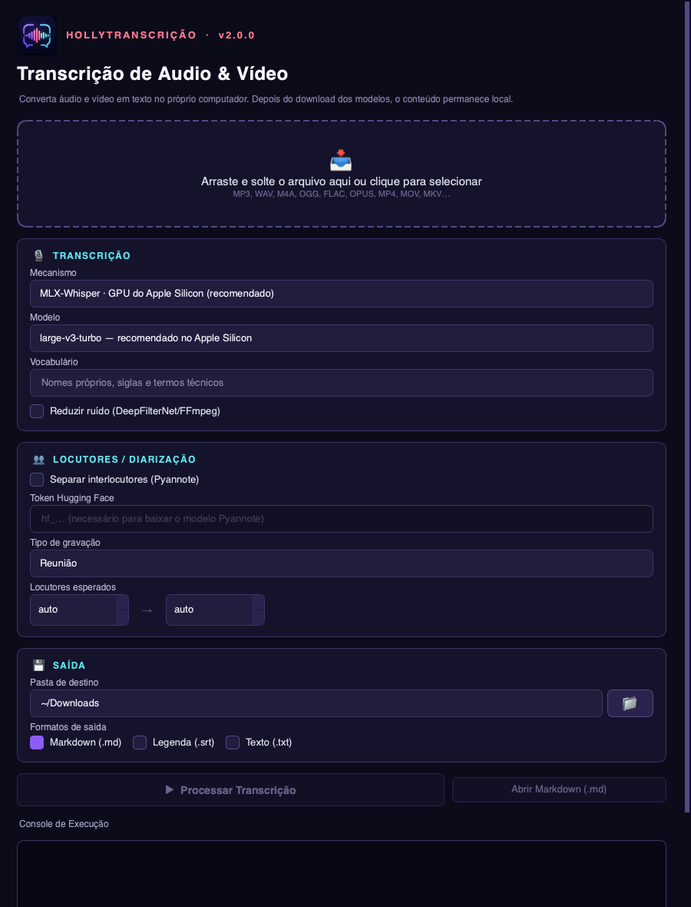

<p align="center">
  
</p>

<h1 align="center">HollyTranscrição</h1>

<p align="center">
  Transcrição local de áudio e vídeo para Markdown, SRT e TXT.<br>
  Privacidade por padrão, aceleração no Apple Silicon e modo portátil em CPU.
</p>

<p align="center">
  
  
  
</p>



## O que o aplicativo faz

- Transcreve MP3, WAV, M4A, OGG, FLAC, OPUS, MP4, MOV, MKV e outros formatos aceitos pelo FFmpeg.
- Usa MLX-Whisper na GPU de Macs com Apple Silicon.
- Oferece Faster-Whisper em CPU como alternativa portátil.
- Separa interlocutores opcionalmente com Pyannote.
- Exporta Markdown estruturado, legenda SRT e texto TXT.
- Preserva resultados antigos: um novo processamento nunca sobrescreve uma transcrição existente.
- Aplica correções determinísticas auditáveis; regras jurídicas só são ativadas quando a gravação é classificada como audiência ou oitiva.
- Mantém o motor de transcrição isolado: uma falha nativa do MLX não fecha a interface.
- Permite cancelar com segurança inclusive durante o download inicial de um modelo.

## Modelos disponíveis

| Modelo | Uso recomendado | Download inicial aproximado |
|---|---|---:|
| Large V3 Turbo | Perfil padrão: rápido e preciso para uso geral | 1,6 GB |
| Large V2 | Alternativa para comparar áudios difíceis, com música ou ruído | 3,1 GB |

O comportamento varia conforme a gravação. O Large V2 não é sempre mais preciso que o V3 Turbo, mas oferece um treinamento diferente que pode produzir um resultado melhor em determinados áudios. O download ocorre somente no primeiro uso e agora é mostrado separadamente da etapa de transcrição.

## Privacidade

O áudio e o texto são processados localmente. O aplicativo não envia transcrições para serviços de IA ou APIs externas. Há acesso à internet apenas para baixar modelos na primeira utilização.

O token do Hugging Face, necessário somente para a separação opcional de interlocutores, permanece em memória durante a sessão e não é salvo nas preferências do sistema.

## Compatibilidade

| Sistema | Situação | Mecanismo |
|---|---|---|
| macOS em Apple Silicon | Validado no MacBook Air M5 | MLX-Whisper ou Faster-Whisper |
| macOS Intel | Compatibilidade prevista, ainda não validada | Faster-Whisper em CPU |
| Windows 10/11 | Código preparado, pacote ainda não validado | Faster-Whisper em CPU |
| Linux | Código preparado, pacote ainda não validado | Faster-Whisper em CPU |

O MLX é exclusivo do Apple Silicon. Windows, Linux e Macs Intel usam o modo de CPU.

## Instalação para desenvolvimento

Requisitos: Python 3.11 a 3.13 e [FFmpeg](https://ffmpeg.org/download.html) disponível no sistema.

```bash
python3 -m venv .venv
source .venv/bin/activate
python -m pip install --upgrade pip
python -m pip install -r requirements.txt
python -m hollytranscricao.main
```

Para habilitar a separação experimental de interlocutores em desenvolvimento:

```bash
python -m pip install -r requirements-diarization.txt
```

O Pyannote exige uma conta e um token do Hugging Face, além da aceitação dos termos do modelo correspondente.
Ele não faz parte do build padrão enquanto a cadeia PyTorch/Torchaudio não possui uma combinação sem alertas conhecidos; consulte o relatório de auditoria antes de distribuí-lo.

## Qualidade e segurança

```bash
python -m pip install -r requirements-dev.txt
ruff check hollytranscricao tests
pytest
bandit -r hollytranscricao
```

O relatório da revisão que originou a versão 2.0 está em [AUDIT_REPORT.md](AUDIT_REPORT.md). Instruções de empacotamento estão em [BUILDING.md](BUILDING.md).

## Estrutura

```text
hollytranscricao/   aplicativo e interface
assets/             identidade visual e ícones multiplataforma
docs/images/        imagens usadas na documentação
hooks/              ajustes de empacotamento do MLX
tests/              testes automatizados
```

## Versão

Versão atual: **2.0.1 (build 2)**. O histórico está em [CHANGELOG.md](CHANGELOG.md).

## Licença

Copyright 2026 Thiago Albuquerque. Distribuído sob a [Apache License 2.0](LICENSE).
