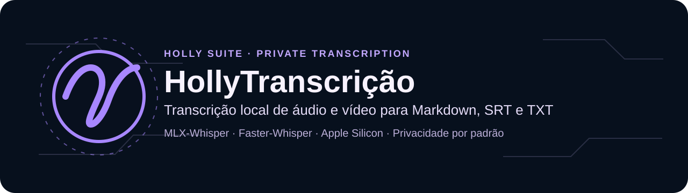

<p align="center">
  
</p>

<p align="center">
  <strong>Transcrição local de áudio e vídeo para Markdown, SRT e TXT.</strong><br>
  Privacidade por padrão · Apple Silicon · Modo portátil em CPU
</p>

<p align="center">
  
  
  
</p>

> **Parte da suíte Holly**  
> Ferramentas local-first para texto, documentos e mídia, com privacidade por padrão e segurança verificável.  
> [HollyOCR](https://github.com/HollyGM/HollyOCR) · [HollyCorretor](https://github.com/HollyGM/HollyCorretor) · [HollyOptimizer](https://github.com/HollyGM/HollyOptimizer) · [Texto em Áudio](https://github.com/HollyGM/HollyTextoEmAudio) (voz online)


## O que o aplicativo faz

- Transcreve áudio (MP3, WAV, M4A, AAC, OGG, OPUS, FLAC, WMA, AIFF, AMR) e vídeo (MP4, MOV, QT, M4V, MKV, WEBM, AVI, WMV, MPG/MPEG, 3GP, TS). Outros formatos aceitos pelo FFmpeg também podem ser abertos, com um aviso prévio.
- Usa MLX-Whisper na GPU de Macs com Apple Silicon.
- Oferece Faster-Whisper em CPU como alternativa portátil.
- Reduz ruído opcionalmente antes da transcrição, com o filtro `afftdn` do FFmpeg ou com o DeepFilterNet, quando instalado à parte.
- Separa interlocutores opcionalmente com Pyannote, inclusive quando a troca de voz ocorre dentro de um segmento e há alinhamento completo por palavra.
- Exporta Markdown estruturado, legenda SRT e texto TXT.
- Preserva resultados antigos: cada arquivo é publicado de forma atômica e exclusiva, então nem um novo processamento nem duas transcrições simultâneas sobrescrevem um resultado existente.
- Aplica correções determinísticas auditáveis; regras jurídicas só são ativadas quando a gravação é classificada como audiência ou oitiva.
- Mantém o motor de transcrição isolado: o MLX só é carregado no processo do motor, e uma falha nativa não fecha a interface.
- Permite cancelar com segurança em qualquer etapa, inclusive na inicialização do motor e no download inicial de um modelo. No macOS e no Linux, o cancelamento também encerra os subprocessos do FFmpeg.
- Bloqueia a troca de arquivo e o início de outra transcrição enquanto o motor trabalha.

## Modelos disponíveis

| Modelo | Uso recomendado | Download inicial aproximado |
|---|---|---:|
| Large V3 Turbo | Perfil padrão: rápido e preciso para uso geral | 1,6 GB |
| Large V2 | Alternativa para comparar áudios difíceis, com música ou ruído | 3,1 GB |

O comportamento varia conforme a gravação. O Large V2 não é sempre mais preciso que o V3 Turbo, mas oferece um treinamento diferente que pode produzir um resultado melhor em determinados áudios. O download ocorre somente no primeiro uso, aparece como etapa própria na barra de progresso e pode ser cancelado.

## Arquivos gerados

Os resultados são gravados na pasta de destino escolhida; por padrão, `~/Downloads`. Caminhos digitados com `~` são aceitos.

| Formato | Nome do arquivo |
|---|---|
| Markdown | `<nome>_transcricao.md` |
| Legenda SRT | `<nome>.srt` |
| Texto | `<nome>_transcricao.txt` |

Se o nome já existir, o novo arquivo recebe um sufixo numérico, como `<nome>_transcricao-2.md`. Ao final, o botão de abertura indica qual formato foi gerado.

## Privacidade

O áudio e o texto são processados localmente. O aplicativo não envia transcrições para serviços de IA ou APIs externas. Há acesso à internet apenas para baixar modelos na primeira utilização.

Os arquivos temporários de cada transcrição ficam em uma pasta própria e são apagados ao final da operação, inclusive após cancelamento ou falha do motor.

O token do Hugging Face, necessário somente para a separação opcional de interlocutores, permanece em memória durante a sessão e não é salvo nas preferências do sistema.

## Compatibilidade

| Sistema | Situação | Mecanismo |
|---|---|---|
| macOS em Apple Silicon | Validado no MacBook Air M5 | MLX-Whisper ou Faster-Whisper |
| macOS Intel | Compatibilidade prevista, ainda não validada | Faster-Whisper em CPU |
| Windows 10/11 | Código preparado, pacote ainda não validado | Faster-Whisper em CPU |
| Linux | Código preparado, pacote ainda não validado | Faster-Whisper em CPU |

O MLX é exclusivo do Apple Silicon. Windows, Linux e Macs Intel usam o modo de CPU.

## Instalação para desenvolvimento

Requisitos: Python 3.11 a 3.13 e [FFmpeg](https://ffmpeg.org/download.html) disponível no `PATH`; no macOS, o aplicativo também procura o FFmpeg em `/opt/homebrew/bin` e `/usr/local/bin`. A integração contínua valida Python 3.11 e 3.12 em macOS, Linux e Windows, e o empacotamento usa Python 3.12.

```bash
python3 -m venv .venv
source .venv/bin/activate
python -m pip install --upgrade pip
python -m pip install -r requirements.txt
python -m hollytranscricao.main
```

O `requirements.txt` instala o núcleo com versões fixas: PySide6 6.11.2, Faster-Whisper 1.2.1, soundfile 0.14.0 e urllib3 2.8.0 ou superior; em Macs com Apple Silicon, também MLX 0.32.3 e MLX-Whisper 0.4.3. As mesmas versões estão declaradas no `pyproject.toml`.

Para habilitar a separação experimental de interlocutores em desenvolvimento:

```bash
python -m pip install -r requirements-diarization.txt
```

O Pyannote exige uma conta e um token do Hugging Face, além da aceitação dos termos do modelo correspondente.
Ele não faz parte do build padrão enquanto a cadeia PyTorch/Torchaudio não possui uma combinação sem alertas conhecidos; consulte o relatório de auditoria antes de distribuí-lo.

## Qualidade e segurança

```bash
python -m pip install -r requirements-dev.txt
ruff check hollytranscricao tests
pytest
bandit -q -ll -r hollytranscricao
pip-audit
```

Os testes de interface rodam sem abrir janelas: `tests/conftest.py` define `QT_QPA_PLATFORM=offscreen`. Ruff, pytest e Bandit também rodam na [integração contínua](.github/workflows/tests.yml); o `pip-audit` consulta bases públicas de vulnerabilidades e precisa de internet.

O relatório de revisão, atualizado na versão 2.0.4 com a auditoria de dependências de outubro de 2026, está em [AUDIT_REPORT.md](AUDIT_REPORT.md). Instruções de empacotamento estão em [BUILDING.md](BUILDING.md).

## Estrutura

```text
hollytranscricao/   aplicativo e interface
assets/             identidade visual e ícones multiplataforma
docs/branding/      banner do README na identidade da suíte Holly
docs/images/        imagens usadas na documentação
hooks/              ajustes de empacotamento do MLX
tests/              testes automatizados
```

## Versão

Versão atual: **2.0.4 (build 5)**, de 2 de outubro de 2026. O histórico está em [CHANGELOG.md](CHANGELOG.md).

## Licença

Copyright 2026 Thiago Albuquerque. Distribuído sob a [Apache License 2.0](LICENSE).
